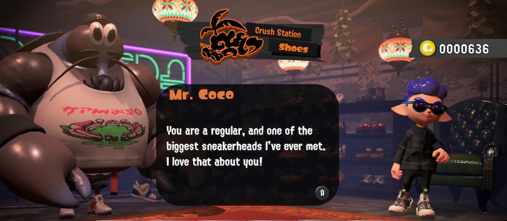

Hi, I'm sneakerhax,

I have spent the last ten years on [Red Teams](https://en.wikipedia.org/wiki/Red_team), helping some of the world's largest software companies discover soft spots in their security posture. Additionally, I demonstrate the impact of exploiting those weaknesses, test the response capabilities of Blue Teams, provide recommendations for the enhancement of detections, and identify systemic security process issues at scale. Through data and storytelling, I help businesses prioritize security issues, provide unbiased feedback to inform decisions about allocating security resources, and test the effectiveness of security investments.

Before working on Red Teams, I spent eight years in Information Technology

## Github Overview

My Github contains documentation, posts, tools, and experimental code for Red Team purposes.

## Areas of focus:

* Red Team
* Cloud Native
* Linux
* Containers
* Kubernetes

## Additional Information

Programming languages, software, and licenses:

  
 

Contact information:

  
